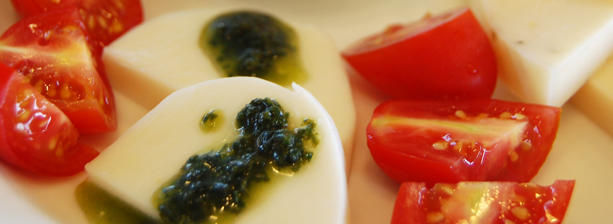

# ①課題名

チーズアカデミー

## ②課題内容（どんな作品か）

チーズ職人養成学校「チーズアカデミーTOKYO」の紹介LP

## ③アプリのデプロイURL

https://wild-river.github.io/kadai00_cheese-academy/ 

もう１つのオリジナルバージョン「アトリエフロマージュ」はこちらにアップいたしました。

github
https://github.com/Wild-River/kadai00_atlier-fromage.git 
アプリのデプロイURL
https://wild-river.github.io/kadai00_atlier-fromage/

## ④アプリのログイン用IDまたはPassword（ある場合）

- ID: 今回なし
- PW: 今回なし

## ⑤工夫した点・こだわった点

- CSSのみでさまざまな表現をすることを意識して制作しました。
- PCのヘッダーは`position: sticky`を使用して上部固定とし、背景を半透明にすることでコンテンツが透けて見えるデザインにしています。
- マウスを乗せた時の変化や、ヘッダーからの滑らかなスクロール、画像が右から左へ流れるような視覚効果などをCSSで表現しました。

## ⑥難しかった点・次回トライしたいこと（又は機能）

- スマートフォンやタブレットでの表示最適化に苦労しました。
- タブレットサイズ以下ではハンバーガーメニューを表示し、htmlのチェックボックスの有無を利用して開閉を制御する実装を行いました。
  `<input type="checkbox" name="" id="toggle" hidden>`

## ⑦フリー項目（感想、シェアしたいこと等なんでも）

CSSのみでもさまざまな表現が可能であることを実感しました。  
今後のJavaScriptの学習と合わせて、実装方法を選択できるようになりたいです。
